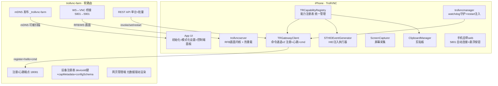

# 01 - 愿景与设计基线

> **来源**：IPA改造计划.md 行 173-320（## 0. 设计基线 + ## 1. 总体架构）
> **关注点**：核心原则、连接端口规划、连接方向与身份、UI 界面与交互规范、能力调用链路、总体架构
> **索引**：[返回主文档](IPA改造计划.md)

---

## 0. 设计基线

### 0.1 核心原则

| 项 | 结论 |
|---|---|
| 能力即服务 | 所有 IPA 能力（控制型+配置型）暴露为统一 API，外部可远程调用 |
| 能力分类 | 控制型（即时执行，一级菜单）/ 配置型（状态调整，二级菜单） |
| 作用域 | 单台（聚焦视图/直连 web）/ 批量（网关勾选多台统一覆盖） |
| 能力自描述 | 能力元数据（id/title/icon/route/params）由设备注册表自动生成，前端自动渲染 |
| 新增能力即插即用 | 只需在注册表加一行（metadata + executor），无需改其他文件 |
| 配置表单分区 | 按 reload 分区显示：立即生效 / 热重载 / 网关刷新 / 需重启 |
| 批量确认 | restart/stop 类需二次确认弹窗 |
| 触控坐标 | 归一化 0-1（跨设备脚本复用），设备侧转原生像素 |
| 错误处理 | 显式抛错不静默降级，失败明确返回错误信息 |
| 配置唯一来源 | 设置（NSUserDefaults）是默认值唯一来源，代码不为用户做选择 |

### 0.2 连接与端口规划

| 端口 | 角色 | 说明 | v1.8 实现状态 |
|---|---|---|---|
| 5801 | 前端入口 | 浏览器/WebSocket 客户端访问（局域网直连） | ✅ 已实现 |
| 5901 | 后端入口 | AI 工具/脚本/标准 VNC viewers（局域网直连） | ✅ 已实现 |
| 18081 | 注册端口 | 设备注册到网关的 TCP 端口 | ✅ 已实现（regServer.listen） |
| 18181 | 隧道端口 | 跨网络访问经网关隧道（替代直连 5801/5901） | ✅ 已实现（Phase 7） |
| 46752 | 本地控制端口 | trollvncserver 本地客户端管理（经网关代理暴露） | ✅ 已实现 |

> **废弃**：Repeater 模式和 5500 端口不再使用（**v1.8 修正**：v1.3 起声称"代码已删"实际全量残留，Phase 6 才真正删除）。

### 0.3 连接方向与身份

| 项 | 结论 |
|---|---|
| 连接方向 | 手机**携带信息主动注册**到网关（内网 IP 即身份） |
| 隧道建立 | 注册成功后**自动开启 18181 隧道**，无需额外操作 |
| 局域网直连 | 5901/5801 端口在局域网内可**不经网关**直接对外提供访问 |
| 跨网络访问 | **其他所有连接都走隧道**（经网关 18181 隧道转发） |
| 在线状态 | 网关维护：注册连接存活 + 心跳（不用 TCP 探测 5901） |
| 设备身份 | 首启生成 **UUID**，拼进 DesktopName，注册时上报，网关按 deviceId 建索引 |
| 初始化 | 打开一次 App → "搜索网关（mDNS）/ 手动输入 IP" → 保存，之后全自动 |
| 鉴权 | 内网可信，不设设备鉴权；网关侧保留 FARM_TOKEN 一行兜底 |
| 后台常驻 | 沿用 LaunchAtLogin + SBS 预启动；真机实测存活时长 |

### 0.4 UI 界面与交互规范（v1.8.3 定型）

> **核心原则**：所有端的能力菜单统一为**纵向列表分组菜单**（按 category 分组），差异仅在于触发方式和图标/名称的显示形式。

#### 0.4.1 界面定位

| 界面 | 定位 | 卡片墙 | 大屏操控 |
|---|---|---|---|
| PC web 控制台 | 多设备墙 + 大屏操控 | 卡片完整 RFB 连接（viewOnly，可选帧率节流） | 屏幕右侧**纵向分组菜单图标列** |
| 手机 web 控制台 | 多设备墙 + 大屏操控 | 卡片完整 RFB 连接（viewOnly，可选帧率节流） | **悬浮按钮** → 纵向列表能力分组菜单 |
| IPA 控制端 | 多设备墙 + 大屏操控 | 卡片完整 RFB 连接（viewOnly，可选帧率节流） | **悬浮按钮** → 纵向列表能力分组菜单 |
| 5801 电脑访问 | 单设备直连（无卡片墙） | — | **纵向列表分组菜单**（与 PC web 大屏类似，少外层包装） |
| 5801 手机访问 | 单设备直连（无卡片墙） | — | 全屏 + **悬浮按钮** → 纵向列表能力分组菜单 |

#### 0.4.2 卡片墙交互（点击卡片前）

| 界面 | 卡片操作入口 | 菜单样式 |
|---|---|---|
| PC web 控制台 | 卡片右下角 `⋯` | **纵向列表分组菜单**（能力按 category 分组） |
| 手机 web 控制台 | 卡片右下角 `⋯` | **纵向列表分组菜单**（能力按 category 分组） |
| IPA 控制端 | 卡片右下角 `⋯` | **纵向列表分组菜单**（能力按 category 分组） |

> **关键规则**：所有端的卡片墙状态，点击 `⋯` 均弹出**纵向列表分组菜单**，能力按 category 分组排列。

#### 0.4.3 大屏操控交互（点击卡片后）

| 界面 | 触发方式 | 菜单样式 | 配置入口 |
|---|---|---|---|
| PC web 控制台 | 屏幕右侧固定 | **纵向分组菜单图标列**（仅图标，分组排列） | 图标列底部 ⚙ 按钮 |
| 手机 web 控制台 | **悬浮按钮** → 点击展开 | **纵向列表能力分组菜单**（图标+名称） | 列表底部 ⚙ 按钮 |
| IPA 控制端 | **悬浮按钮** → 点击展开 | **纵向列表能力分组菜单**（图标+名称） | 列表底部 ⚙ 按钮 |
| 5801 电脑访问 | 固定显示 | **纵向列表分组菜单**（与 PC web 大屏类似，少外层包装） | 列表底部 ⚙ 按钮 |
| 5801 手机访问 | **悬浮按钮** → 点击展开 | **纵向列表能力分组菜单**（图标+名称） | 列表底部 ⚙ 按钮 |

> **关键规则**：
> - PC web 大屏 / 5801 电脑访问：**纵向分组菜单图标列**（仅图标）
> - 手机 web / IPA 控制端 / 5801 手机访问：**悬浮按钮** → **纵向列表能力分组菜单**（图标+名称）
> - 点击悬浮按钮展开/收起

#### 0.4.4 卡片墙帧获取（v2.3 修订）

- ~~所有控制台卡片墙**只获取帧**（invoke screenshot API），不建立完整 RFB 连接~~（v1.8.3 旧设计，已弃用）
- 所有控制台卡片墙**建立完整 RFB 连接**（viewOnly 只读），实时渲染画面
- ThumbInterval 作为可选的 **RFB 帧渲染频率控制**（默认不限制=实时渲染，配置后按阈值节流）
- 点击卡片进入大屏操控时切换为可操控 RFB 连接（通过隧道）
- 离线检测：RFB 连接断开/失败标记卡片"不可达"

#### 0.4.5 批量操作入口

- 网关设备墙顶部新增「批量操作」栏
- 勾选多台设备后显示批量能力按钮 + 批量配置按钮
- restart/stop 类操作需二次确认弹窗

### 0.5 能力调用链路

```
控制端（web/AI工具/同网关设备）
  → 网关 REST API / WS / 隧道
  → 设备命令通道（TRGatewayClient _handleServerLine）
  → TRCapabilityRegistry.invoke / setConfig
  → executor block（HID/Touch/LocalCmd/Native）
  → STHIDEventGenerator / ClipboardManager / ScreenCapturer
  → ACK（含 reload 策略）→ 网关 → 控制端
```

> **关键变化**：能力调用不再经 RFB keysym 硬编码，改走注册表统一路由。
> RFB 连接仅用于画面传输；能力执行（Home/电源/触控等）经命令通道直接注入 HID。

---

## 1. 总体架构



---
