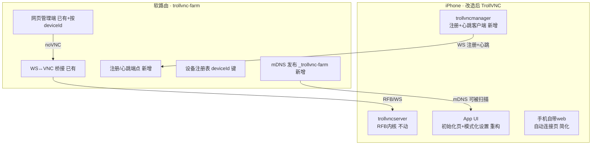

# TrollVNC IPA 内部改造计划（v0.1 草案）

> 目标愿景：**内网自用**的 iOS 设备群控。手机装一次、初始化一次，之后零操作；
> 电脑/手机通过网页（服务器网关）随时看到并操作所有设备；所有操作能力与手机自带 web 完全一致。
> 原则：能力层（RFB + IOHID 注入）是地基，两个 web（手机自带 / 服务器网关）只是同一能力层的两扇门；
> 不做的坚决不做（鉴权、Agent 命令、远程配置、TLS、商业化）。

---

## 0. 设计基线（来自讨论的结论）

| 项 | 结论 |
|---|---|
| 连接方向 | 手机**主动注册**到网关（内网 IP 即身份，端口统一 5901） |
| 在线状态 | **网关维护**：注册连接存活 + 心跳（不用 TCP 探测 5901） |
| 设备身份 | 首启生成 **UUID**，拼进 DesktopName，注册时上报，网关按 deviceId 建索引 |
| 初始化 | 打开一次 App → "搜索网关（mDNS）/ 手动输入 IP" → 保存，之后全自动 |
| 鉴权/命令通道 | **不需要**（内网可信），保留网关侧 FARM_TOKEN 一行兜底 |
| 后台常驻 | 沿用现有 LaunchAtLogin + SBS 预启动；**真机实测**存活时长，接受"重启后打开一次"为已知边界 |
| Web 体验 | "打开 URL 即出画面"，不手工输端口/不点连接；IP 区分设备 |
| Web 自适应 | 手机 web 直连时，画面/控制条/侧边按钮**占比随屏幕自适应**（桌面/手机/横竖屏） |
| UI | 按工作模式（局域网/反向Viewer/反向Repeater）重构；删开发者营销元素 |
| 能力层 | 触摸 / Home / 电源 / 音量 / 键盘 / 剪贴板，两个 web 共用同一 RFB→IOHID 链路 |

---

## 1. 总体架构（改造后）



---

## 2. 分阶段计划

### Phase 0：协议与服务器侧前置（先定契约） ✅ 已完成
**目标**：先定"注册/心跳协议"，网关侧可独立开发与自测，IPA 侧照契约实现。

- 定义注册协议（草案）：
  - 端点：`WS /ws/register?deviceId=&name=&vncPort=`（网关新增）
  - 心跳：网关侧 ws 库原生 ping/pong；手机侧每 30s 发 `{type:'hello'}` 兜底
  - 在线判定：连接存活 + 心跳超时（如 90s 无消息即离线）
- 网关改动：
  - 发布 `_trollvnc-farm._tcp`（bonjour-service 已有能力，新增 publish）
  - 新增 `/ws/register` 端点 + 注册表（deviceId → name/ip/vncPort/lastSeen）
  - 在线状态由"连接存活"驱动，替代/叠加 15s TCP 探测
  - 网页端设备列表改用 deviceId 键
- **验收**：本地冒烟测试——假"手机客户端"连 `/ws/register`，网关列表出现且在线；断开后标离线。

### Phase 1：IPA 最小闭环（零操作核心） ✅ 代码完成（真机联调待做）
**目标**：装一次 → 初始化一次 → 之后自动注册上线，网页点开即连。

| # | 改动 | 位置 | 说明 |
|---|---|---|---|
| 1.1 | 设备 UUID | `TRGatewayClient` | **✅ 已实现**：首启生成并持久化 DeviceUUID，注册时上报 |
| 1.2 | 初始化页 | `TVNCRootListController` / `Root.plist` | **✅ 已实现**：设置页新增「网关」分组（GatewayHost/Port/Token + 「搜索网关」按钮，NSNetServiceBrowser 扫描 `_trollvnc-farm`） |
| 1.3 | 注册+心跳客户端 | `src/trollvncmanager.mm`（新增 TRGatewayClient） | **✅ 已实现**：BSD socket TCP JSON 行协议，连网关注册端口，hello 30s，断线退避重连；已 CI 编译验证 |
| 1.4 | 开机重连 | 沿用 `TVNCServiceCoordinator` LaunchAtLogin/SBS 预启动 | 微调即可，真机验证 |
| 1.5 | 网关联动验证 | 全链路 | 真机初始化 → 网关列表出现（唯一名）→ 点开即出画面 |

- **验收**：真机安装后，打开一次完成初始化；重启/杀掉 App 后重新打开，自动重新注册；网关在线状态随连接变化。
- **不做**：注册鉴权、命令通道。

### Phase 2：UI 重新分类设计（模式化 + 去营销 + 集成归一） ✅ 已完成
**目标**：按工作模式组织设置，删除开发者营销元素，统一设置入口，符合内网自用观感。

**① 页面结构（重新分类）**
| 页 | 内容 | 说明 |
|---|---|---|
| 首页·状态 | 服务大开关、当前模式、本机连接地址+二维码、已连接客户端列表 | 核心交互 |
| 连接模式 | 3 张单选卡片：局域网 / 反向Viewer / 反向Repeater | 模式相关字段按选择显隐 |
| 安全 | Full/View-only 密码、全局只读、剪贴板 | 全局 |
| 画面与性能 | 缩放/帧率/方向/光标；进阶折叠（脏区/Defer/AsyncSwap） | 全局+进阶折叠 |
| 输入 | 滚轮/修饰键映射/自然滚动/辅助触控 | 全局 |
| 高级（折叠） | HTTP 端口/SSL/Bonjour/键盘日志 | 内网自用默认折叠 |
| 关于与诊断 | 版本/查看日志/重置默认 | 无源码/付费入口 |

**② 模式显隐规则（依据互斥逻辑，见附录）**
- 选「局域网」：显示 TCP 端口/Bind/HTTP/Bonjour
- 选「反向 Viewer」：隐藏本地端口/HTTP/Bonjour，显示 Reverse Server
- 选「反向 Repeater」：额外显示 Repeater ID
- 反向模式下 HTTP/Bonjour 等被强制关闭的项显示为“当前模式不可用”而非直接消失

**③ 去除清单（内网自用版）**
- `Root.plist`：View Source Code / Made with ♥ by OwnGoal Studio / Please support our paid works / GPLv2 作者页脚
- `AppDelegate`：`GitHubReleaseUpdater` 启动调用（并删相关文件）
- `webclients/index.vnc` 手动按钮页（Phase 3 替换为自动连接页）
- 保留：View Logs、Reset to Defaults（挪到诊断页）

**④ 集成归一清单**
- 设置入口**统一到 App 内**（.tipa 构建已是如此：TrollVNCPrefs.bundle 拷进 App，/Library 被移除）——不再依赖系统设置
- `CCTrollVNC`（Control Center 模块）：**默认移出构建**（减面）；如内网需要快捷开关再恢复
- Managed.plist 预置 = 默认值，App 内可覆盖；文档写明覆盖策略
- 手机 web 与网关 web 共用同一能力层，交互行为一致（基线）

**验收**：设置页按模式切换正确显隐；无任何外链/付费/源码入口；App 内设置是唯一入口。

### Phase 3：Web 体验打磨 ✅ 已完成（自动连接 + 响应式）
**目标**：手机自带 web 直连“打开即出画面”，且**组件占比随屏幕自适应**。

- 替换 `layout/usr/share/trollvnc/webclients/index.vnc` 为**自动连接页**（复用 noVNC core，autoconnect 到自己 VNC，打开即出画面，去掉原“点击连接”按钮页）
- **响应式自适应（硬需求）**，用 CSS `clamp()/dvh/vw` 流式布局：
  - 画面区：自动等比缩放并**占满可用空间**（scaleViewport），桌面横屏占满剩余区域
  - 控制条：桌面端顶部/侧边紧凑条；**手机端移到底部 dock，触控目标 ≥44px**，窄屏折叠为图标
  - 侧边操作按钮（Home / 电源 / 音量±）：尺寸随屏幕 `clamp()` 缩放，横竖屏切换自适应
  - 键盘/剪贴板入口在移动端以底部面板呈现
- 实现方式：自建轻量响应式页面（复用 `/novnc/core/rfb.js`），替换 index.vnc 并定制样式；不依赖 noVNC 桌面版 UI
- 注：仅局域网模式生效（反向模式会关 HTTP）；网关 web 已是主入口，此项为“浏览器直连手机”的兜底体验
- **验收**：在电脑浏览器、手机浏览器、不同窗口/横竖屏下直连 `http://手机IP:5801`，画面占比合理、按钮可点、无横向溢出

---


---

## 附录：底层互斥逻辑（UI 与配置设计依据）

> 以下互斥关系来自 `trollvncserver.mm` 实际逻辑，UI 的显隐/校验必须遵守。

| # | 互斥/联动点 | 规则（代码依据） | UI 处理 |
|---|---|---|---|
| 1 | 工作模式三选一 | `ReverseMode = none / viewer / repeater`，互斥 | 3 张单选卡片 |
| 2 | 反向模式 vs 本地能力 | 反向开启 → 强制 `port=-1, http=0, bonjour=off`（866–875 行） | 选反向时隐藏①字段，标“当前模式不可用” |
| 3 | Viewer vs Repeater | repeater 才有 RepeaterID | 二级显隐 |
| 4 | VNC 认证 | `FullPassword` 为空=无认证；设置后启用认证；经典 VNC 只认前 8 位 | 密码组提示；空值提示“不设密码不安全” |
| 5 | 全局只读 vs 只读密码 | 全局 `ViewOnly` 优先生效，覆盖只读密码 | 并存但标注优先级 |
| 6 | SSL 证书/私钥 | 必须**成对**，缺一不启用 TLS | 成对校验 |
| 7 | HTTP Port=0 | 关闭网页服务；反向模式强制为 0 | 高级页显示状态 |
| 8 | 脏区检测 | `FullscreenThresholdPercent=0` 关闭 | 进阶折叠 |
| 9 | 滚轮/保活 | `WheelStepPx=0`、`KeepAliveSec=0` 分别禁用 | 滑块带“0=关闭”说明 |
| 10 | 方向同步 | `OrientationPadFix` 仅在 `OrientationSync=on` 时有意义 | 联动显隐 |
| 11 | Bonjour | 反向模式下被强制关闭 | 见 #2 |

> 设计规则：**任何被“当前模式”互斥禁用的项，UI 上要么隐藏、要么置灰并注明原因，不能让用户配置了却不生效。**

## 3. 构建与交付路径

```
改源码（TrollVNC 仓库） → push 到 fork(li78725449-ship-it/TrollVNC)
  → GitHub Actions "Build TrollVNC" → 下载 packages-bootstrap 产物
  → 得到 TrollVNC_<ver>.tipa → TrollStore 安装 → 真机按 Phase 验收
```
- 每次改动以独立 commit 推进，便于回滚；UI 文案走 zh-Hans。
- 服务器侧改动走 `trollvnc-farm` 仓库，本地 `npm test` + 冒烟测试验证后再上软路由。

---

## 4. 明确不做（内网自用边界）

- 注册鉴权 / 设备令牌
- Agent 命令通道（远程启停/推配置/装 App）——后续如需，另立项目
- 远程配置下发（Managed.plist 保持静态预置）
- TLS / 公网安全加固（frp 只做传输，凭 FARM_TOKEN 兜底）
- 多租户 / 审计 / 计费 / 营销

---

## 5. 风险与已知边界

| 风险 | 应对 |
|---|---|
| iOS 后台挂起（心跳不能阻止） | 真机实测存活时长；沿用预启动逻辑；文档写明"重启后可能需打开一次" |
| 反向模式与 HTTP 互斥 | 本方案主走"局域网直连 + 注册心跳"，反向模式仅保留配置能力 |
| mDNS 在某些 AP 下不可达 | 初始化支持手动输入网关 IP 兜底 |
| 私有 API 随 iOS 升级失效 | 锁定 TrollStore 支持范围，升级前灰度 |
| 网关与 IPA 协议不一致 | Phase 0 先定契约，两边各自自测后再联调 |

---

## 6. 里程碑

- M1：Phase 0 完成（网关注册/心跳 + mDNS + 冒烟测试）✅ 已完成并测试通过
- M2：Phase 1 代码完成（1.1/1.2/1.3 已实现并 CI 编译通过）；待做：1.4 开机重连验证、1.5 真机联调（需实体设备）
- M3：Phase 2 UI 重构完成（模式化分组 + 网关配置 + 去营销）
- M4：Phase 3 响应式自动连接 web 完成
- M2：Phase 1 完成（IPA 最小闭环，真机零操作上线）
- M3：Phase 2 完成（UI 重构版 IPA 出包）
- M4：Phase 3 完成（web 兜底体验）—— 按需