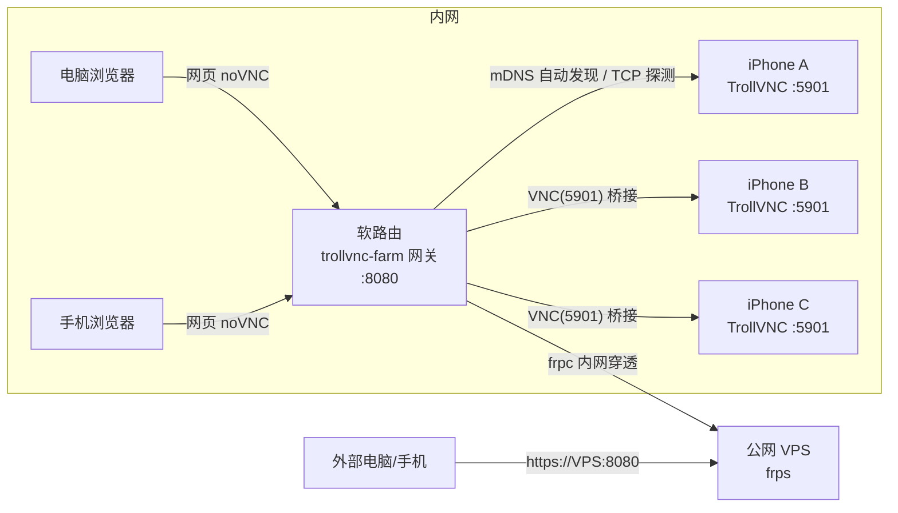

# TrollVNC 群控台（trollvnc-farm）

在软路由上部署的 **TrollVNC 群控网关**：把内网所有跑 TrollVNC 的 iOS 设备集中管理，
电脑/手机用网页即可查看、控制、批量操作；通过 frp/Tailscale 等内网穿透，外部也能访问。

## 架构



- **设备端**：iPhone/iPad 安装 TrollVNC（TrollStore），开启 Bonjour 自动发现，默认端口 5901
- **网关端**：Node.js 服务（本仓库），提供 REST API + WebSocket<->VNC 桥接 + 群控广播 + 网页管理
- **网页端**：noVNC（本地化）嵌入，浏览器直接查看/控制/墙屏/群控

## 功能

- 设备自动发现（mDNS `_rfb._tcp`，TrollVNC 默认开启）+ 手动添加
- **手机主动注册**（TCP 18081，唯一注册通道）：手机连上网关即登记并上报能力清单（capabilities/configs/screen/httpPort，见《开发宪法》7.3），在线状态由连接存活+心跳维护；网关同时发布 `_trollvnc-farm._tcp`（端口=18081）供手机端「搜索网关」初始化扫描
- **手机端零操作**：App 设置页「网关」填地址或点「搜索网关」，之后自动注册上线；也可在 CI managed 构建预置 GatewayHost/Port/Token（仓库 secrets）
- 在线/离线状态轮询（TCP 探测）
- 单设备网页远程控制（noVNC，浏览器直接看/控）
- **墙屏**：同时查看多台设备
- **群控**：选一台主屏，操作自动广播到同组其它设备（RFB 输入字节级广播，延迟低）
- 访问令牌（FARM_TOKEN）鉴权
- 内网穿透：frp 配置示例 + Tailscale / Cloudflare Tunnel 说明

## 快速开始（本机开发）

```sh
npm install
FARM_TOKEN=test123 npm start
# 打开 http://127.0.0.1:8080/?token=test123
```

跑测试：

```sh
npm test   # API + WS<->TCP 桥接 + 群控广播 冒烟测试
```

## 部署（软路由）

- Docker 方式：见 [deploy/openwrt-docker.md](deploy/openwrt-docker.md)
- 无 Docker（Entware+Node）：见 [deploy/openwrt-native.md](deploy/openwrt-native.md)

## 内网穿透

见 [frp/README.md](frp/README.md)：frps（VPS）+ frpc（软路由）配置示例，
以及 Tailscale / Cloudflare Tunnel 替代方案。

## API 一览

| 方法 | 路径 | 说明 |
|---|---|---|
| GET | /api/state | 网关状态 |
| GET | /api/devices | 设备列表 |
| POST | /api/devices | 添加设备 `{name,host,port,group,note}` |
| PATCH | /api/devices/:id | 修改设备 |
| DELETE | /api/devices/:id | 删除设备 |
| POST | /api/devices/:id/ping | 立即探测在线状态 |
| WS | /ws/vnc/:id | VNC 桥接；`?grp=组名` 加入群控组，`?grp=组名&broadcast=1` 作为广播主屏 |
| GET | /api/devices/:id | 设备完整详情（含能力清单） |
| POST | /api/devices/:id/command | 命令通道：`{cmd:"ping"[,timeout:ms]}` → 网关下发并等待手机 ack（默认 5s，超时 504；v1 仅 ping，set 未开放） |
| TCP | :18081 (FARM_REG_PORT) | 手机注册+心跳（JSON 行协议）：发 `{"type":"register",...}` 收 `ack`，每 30s 发 `{"type":"hello"}`；register 可携带 `capabilities/configs/screen/httpPort`（能力清单，见《开发宪法》7.3） |

鉴权：设置 `FARM_TOKEN` 后，API 需 `Authorization: Bearer <token>`，WS 需 `?token=`，网页需 `?token=`。

## 配置项（环境变量）

| 变量 | 默认 | 说明 |
|---|---|---|
| FARM_PORT | 8080 | 监听端口 |
| FARM_HOST | 0.0.0.0 | 监听地址 |
| FARM_TOKEN | (空) | 访问令牌；为空表示不鉴权（仅限可信内网） |
| FARM_PROBE_INTERVAL | 15000 | 设备在线探测间隔(ms)（已注册设备不探测，由连接存活+心跳维护） |
| FARM_REG_PORT | 18081 | 手机注册 TCP 端口（mDNS `_trollvnc-farm._tcp` 也发布此端口） |
| FARM_DATA_DIR | ./data | 设备列表持久化目录 |

## 已知限制（v1）

- **群控广播只作用于当前有活跃网页会话的设备**（即墙屏上打开的机器）；纯后台静默广播需要网关侧实现 RFB 客户端（后续版本）
- **“批量启停手机上的 TrollVNC 服务”** 需要手机端 Agent（如基于 ios-mcp/自研 TrollStore 插件），v1 未包含；当前批量能力 = 批量查看 + 群控广播 + 批量状态管理
- 设备分辨率不同时，广播坐标按主屏坐标发送，其它设备可能略有偏差
- 访问令牌为共享密钥；对外网暴露建议叠加 HTTPS + 反代/CF Access 等访问控制
- 身份合并按 host:port + deviceId；若设备在「mDNS 发现」与「注册」之间更换了 IP，可能短暂出现双卡（根治方案：B3 在 Bonjour TXT 携带 deviceId）

## Roadmap

- [ ] 网关侧 RFB 客户端：静默控制通道，广播不依赖网页会话
- [ ] 手机端 Agent（TrollStore 插件）：远程启停服务、推配置（Managed.plist）、批量设置
- [ ] 录制/回放、定时任务、设备分组权限
- [ ] HTTPS 内置支持（或 Caddy 反代示例）
